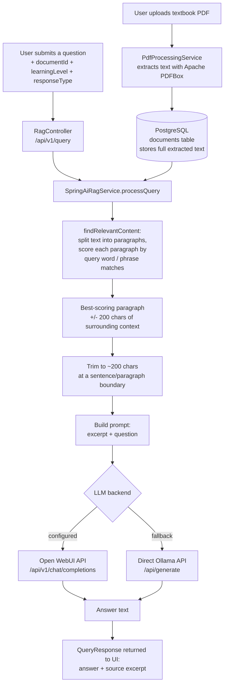

# Textbook RAG Assistant

A Spring Boot application that lets you upload a textbook PDF and ask questions about it, answered by an LLM using only the textbook's own text.

## What this is

Imagine you're studying from a specific textbook — say, a linear algebra textbook — and you want to ask it questions the way you'd ask a tutor, but get answers that stick to exactly what that book says, in the terminology and style your professor uses. That's what this project does.

You upload a PDF of the textbook. The app extracts the text and stores it. When you ask a question, it searches the stored textbook text for the passage that best matches your question, hands that passage to a language model along with your question, and asks the model to answer using only that excerpt. The result is a chat-style Q&A tool that stays "textbook-faithful" instead of answering from the model's general knowledge.

It ships as a web app (a simple chat UI built with Thymeleaf templates) and is set up to run either locally with a self-hosted LLM (via Ollama) or deployed to Railway.

## Key features

- **PDF upload and text extraction** — upload a textbook PDF; text is extracted with Apache PDFBox and stored in PostgreSQL.
- **Global or per-document search** — query across a single uploaded document, or search whatever textbook is loaded by default.
- **Textbook-faithful answers** — the LLM prompt explicitly instructs the model to answer only from the retrieved excerpt, and to say so if the excerpt doesn't contain enough information.
- **Configurable learning level and response style** — requests carry a `learningLevel` (beginner/intermediate/advanced) and `responseType` (explanation/summary/step-by-step), which are passed through the API (the current implementation does not yet vary the prompt by these fields — see Implementation Notes).
- **Pluggable LLM backend** — talks to a local Ollama server by default, or to an Open WebUI-compatible endpoint if configured (used for the Railway deployment).
- **Chapter mapping data** — a static `chapter_mapping.json` resource for organizing content by chapter in the UI.
- **Preloaded default textbook** — on cloud deployments (`SPRING_PROFILES_ACTIVE=cloud`), the app auto-loads a bundled "Applied Linear Algebra" text so there's content to query without uploading anything first.

## How it works

At a high level this is a **retrieval step + a generation step**, but it's worth being precise about what "retrieval" means here today: it is a **keyword/paragraph scoring search over the stored plain text**, not a vector/embedding similarity search — see the note at the end of this section.



Step by step:

1. **Ingestion** — `PdfProcessingService` saves the uploaded PDF to disk and uses Apache PDFBox (`PDFTextStripper`) to extract its full text.
2. **Storage** — the extracted text is saved as a single `TEXT` column on a `Document` row in PostgreSQL (`document_repository` / `documents` table). There is also a `DocumentChunk` entity and `document_chunks` table defined in the schema, intended for storing pre-split chunks, but the active query path (`SpringAiRagService`) reads directly from `Document.extractedText` rather than from `DocumentChunk` rows.
3. **Retrieval** — when a question comes in, `findRelevantContent()` splits the document's text into paragraphs (on blank lines), scores each paragraph by counting matching query words, bonus points for matching two-word phrases, and a bigger bonus if the paragraph contains the whole query verbatim. The highest-scoring paragraph is selected and expanded with ~200 characters of surrounding text for context.
4. **Prompt construction** — the retrieved excerpt is trimmed to roughly 200 characters (cut at a sentence or paragraph boundary where possible) and inserted into a fixed prompt template: *"Based on this brief excerpt from a linear algebra textbook, answer the question. If the excerpt doesn't contain enough information, say so clearly. Excerpt: ... Question: ... Answer:"*.
5. **Generation** — the prompt is sent as a chat completion request. If an Open WebUI URL/API key is configured (`RAILWAY_SERVICE_OPEN_WEBUI_URL`, `OPEN_WEBUI_API_KEY`), it's sent to Open WebUI's `/api/v1/chat/completions` endpoint; otherwise it falls back to a direct call to Ollama's `/api/generate` endpoint. The model name comes from `spring.ai.ollama.chat.options.model` (default `qwen2.5:0.5b` in `application.yml`, `gemma2` in `env.example`).
6. **Response** — the model's answer, plus the retrieved excerpt as the cited source, is returned to the caller as a `QueryResponse` and rendered in the chat UI.

**Note on "RAG" and vector search**: the project depends on Spring AI's Ollama and pgvector starters (`pom.xml`) and configures a 768-dimension pgvector store (`application.yml`), and the README's prior version described this as an in-progress capability. As of this codebase, however, the actual retrieval logic in `SpringAiRagService` is plain keyword/paragraph scoring over raw text, not embedding-based similarity search — no embedding calls or vector-store lookups occur in the query path. The `DocumentChunk` entity/table and the pgvector dependencies appear to be scaffolding for a planned embeddings-based retrieval upgrade rather than code currently in use.

## Tech stack

- **Language / runtime**: Java 17
- **Framework**: Spring Boot 3.2 (Spring Web, Spring Data JPA, Spring Security, Thymeleaf, Bean Validation)
- **AI integration**: Spring AI (`spring-ai-ollama-spring-boot-starter`, `spring-ai-pgvector-store-spring-boot-starter`, version `1.0.0-M6`) — dependencies present, but current querying is done via direct HTTP calls (`RestTemplate`) to Ollama/Open WebUI rather than through Spring AI's abstractions
- **LLM serving**: Ollama (local), or an Open WebUI-compatible chat completions endpoint (e.g. on Railway)
- **Database**: PostgreSQL (with the `pgvector` extension available for future vector search)
- **PDF parsing**: Apache PDFBox 2.0.29
- **Build tool**: Maven (with Maven Wrapper)
- **Containerization / deployment**: Docker, Docker Compose, and Railway (`railway.json`/`railway.toml`, `nixpacks.toml`, `Procfile`)

## Project structure

```
Textbook_RAG_Assistant/
├── src/main/java/com/textbookassistant/
│   ├── TextbookRagAssistantApplication.java   # Spring Boot entry point
│   ├── config/                                # DB, security, and startup data-loading config
│   ├── controller/                            # REST + web controllers (RagController, WebController, HealthController)
│   ├── dto/                                   # Request/response payloads (QueryRequest, QueryResponse, UploadResponse)
│   ├── model/                                 # JPA entities (Document, DocumentChunk)
│   ├── repository/                            # Spring Data JPA repositories
│   └── service/                               # PdfProcessingService (ingestion), SpringAiRagService (retrieval + generation)
├── src/main/resources/
│   ├── application.yml / application-docker.yml / application-cloud.yml   # Profile-specific config
│   ├── schema.sql                             # Database schema
│   ├── textbook_content.txt                   # Bundled default textbook text (loaded on cloud profile)
│   ├── static/chapter_mapping.json             # Chapter metadata for the UI
│   └── templates/                             # Thymeleaf templates (chat.html, index.html)
├── data/uploads/, data/processed/             # Local storage for uploaded PDFs
├── scripts/                                   # Setup/deployment helper scripts (DB setup, Ollama setup, textbook extraction)
├── docs/                                      # Deployment guides and design notes
├── Dockerfile, Dockerfile.openwebui           # Container build definitions
├── docker-compose.yml, docker-compose.openwebui.yml
├── railway.json, railway.toml, nixpacks.toml, Procfile   # Railway deployment configuration
├── env.example                                # Template for local environment variables
└── pom.xml                                    # Maven build and dependencies
```

## Setup / running locally

### Prerequisites

- Java 17+
- Maven 3.6+ (or use the included `./mvnw` wrapper)
- Docker and Docker Compose (for PostgreSQL)
- [Ollama](https://ollama.com) running locally, with the chat and embedding models pulled (e.g. `ollama pull gemma2`, `ollama pull nomic-embed-text`)

### Steps

```bash
# 1. Clone the repository
git clone https://github.com/rsheth8/Textbook_RAG_Assistant.git
cd Textbook_RAG_Assistant

# 2. Copy the environment template and adjust values as needed
cp env.example .env

# 3. Start PostgreSQL
docker-compose up -d postgres

# 4. Build and run the application
./mvnw clean package
./mvnw spring-boot:run
```

The app listens on **http://localhost:8080** by default (chat UI at `/`, health check at `/health`).

### Environment variables (from `env.example` / `application.yml`)

| Variable | Purpose | Default |
|---|---|---|
| `DATABASE_URL` / `SPRING_DATASOURCE_URL` (via `application.yml`) | PostgreSQL connection | `jdbc:postgresql://localhost:5432/textbook_assistant` |
| `POSTGRES_USER`, `POSTGRES_PASSWORD`, `POSTGRES_DB` | DB credentials for Docker Compose | `postgres` / `password` / `textbook_assistant` |
| `OLLAMA_BASE_URL` | Ollama server URL | `http://localhost:11434` |
| `OLLAMA_MODEL` | Chat model name | `qwen2.5:0.5b` (`application.yml`) / `gemma2` (`env.example`) |
| `OLLAMA_EMBEDDING_MODEL` | Embedding model name (for future vector search) | `nomic-embed-text` |
| `OLLAMA_TEMPERATURE`, `OLLAMA_MAX_TOKENS` | Chat generation parameters | `0.7`, `2048` |
| `CHUNK_SIZE`, `CHUNK_OVERLAP` | Configured but not currently used by the active keyword-search retrieval path | `300`/`50` (`application.yml`), `500`/`100` (`env.example`) |
| `MAX_RETRIEVAL_RESULTS` | Configured retrieval result count | `3` |
| `UPLOAD_DIR`, `PROCESSED_DIR` | Local storage paths for uploaded/processed files | `data/uploads`, `data/processed` |
| `RAILWAY_SERVICE_OPEN_WEBUI_URL`, `OPEN_WEBUI_API_KEY` | Optional Open WebUI endpoint/key used instead of calling Ollama directly | unset (falls back to direct Ollama) |
| `SPRING_PROFILES_ACTIVE` | `local`, `docker`, or `cloud` — controls which `application-*.yml` is active and whether the default textbook auto-loads | `local` |

### Tests

```bash
./mvnw test
```

## Notable implementation details / design decisions

- **Retrieval is keyword-based, not embedding-based, today.** Despite the pgvector and Spring AI Ollama-embedding dependencies being wired into `pom.xml` and `application.yml` (768-dimension vector store, `nomic-embed-text` embedding model config), the query path in `SpringAiRagService.findRelevantContent()` does simple word/phrase scoring over paragraphs of the raw extracted text — no embeddings are generated or compared at query time.
- **The `DocumentChunk` entity/table exists but isn't populated or read by the current query flow** — the whole document's `extractedText` is searched directly instead. This, together with the vector-store config, suggests the codebase is partway toward a chunk + embedding + vector-similarity retrieval design that hasn't been finished.
- **Prompt context is deliberately small.** The retrieved excerpt is capped at roughly 200 characters before being sent to the LLM, explicitly to avoid sending large chunks of textbook text to the model — this keeps the app usable with small local models (the default configured model is `qwen2.5:0.5b`, a very small model, presumably chosen to run cheaply on Railway).
- **Two possible generation backends**: the app can call a self-hosted Ollama instance directly, or route through an Open WebUI-compatible chat completions API when `RAILWAY_SERVICE_OPEN_WEBUI_URL` is set — used for the Railway deployment described in `docs/RAILWAY_DEPLOYMENT.md` and `docs/RAILWAY_DEPLOYMENT_GUIDE.md`.
- **Cloud auto-seeding**: under the `cloud` Spring profile, `DataInitializationConfig` automatically loads a bundled "Applied Linear Algebra" textbook (from `src/main/resources/textbook_content.txt`, with a hardcoded fallback text if that resource can't be read) so the deployed app has content to query without requiring an upload first.
- **`documentId = 0` means "search everything"**: both the controller and service treat a document ID of `0` as a request to search the first available document rather than a specific one, effectively acting as the "global search" feature described in the UI.
